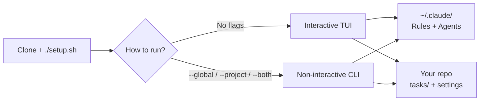
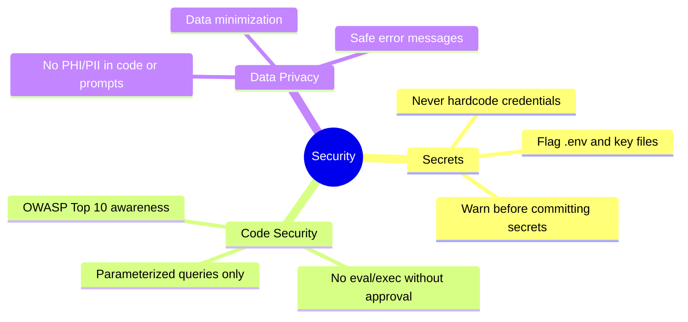
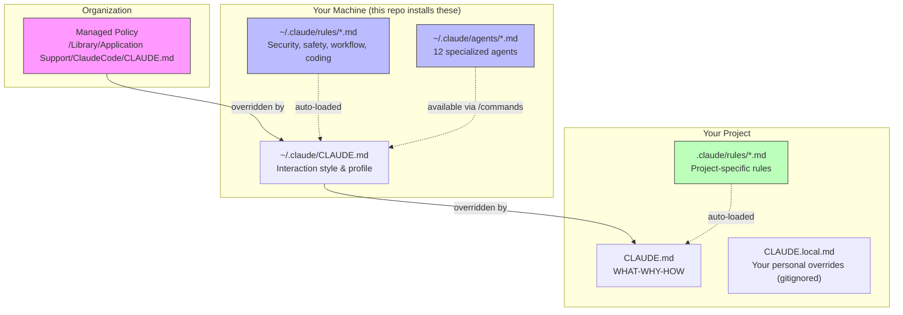

<p align="center">
  <h1 align="center">dotai</h1>
  <p align="center">
    Opinionated AI coding standards for Claude Code.<br/>
    Security guardrails · Workflow rules · Specialized agents · One-command setup.
  </p>
</p>

<p align="center">
  
  
  
  
</p>

---

## What Is This?

When engineers use AI coding assistants like [Claude Code](https://docs.anthropic.com/en/docs/claude-code), the assistant follows instructions from special `CLAUDE.md` files. These files tell the AI **how to behave**, **what to avoid**, and **how to work** on your code.

Without shared standards, every engineer gets a different AI experience — and critical security rules might be missing entirely.

This repo provides **a shared set of rules and specialized agents** that any engineer can install with one command. Think of it as a "team policy" for your AI assistant.



## Quick Start

### Setup (one time)

```bash
git clone https://github.com/Muadiv/dotai.git
cd dotai
./setup.sh                    # creates venv + installs the command
```

> **Windows?** Use `setup.bat` instead, or skip straight to the [PowerShell installer](#powershell-no-python-required) which needs no Python at all.

### Run (from any directory)

```bash
dotai                    # interactive TUI
dotai --global           # install everything globally
dotai --project          # install project template here
dotai --both             # global + project
dotai --update           # pull latest, then install
dotai --update --global  # pull latest + install globally
dotai --no-tasks         # skip creating tasks/ directories
dotai --restore          # restore from latest backup
dotai --restore 20260223-120000  # restore specific backup
dotai --auto-read        # auto-approve read ops (with --project/--both)
dotai --model opus       # set Opus as default model (sonnet|opus|haiku|none)
dotai --uninstall        # remove managed files from ~/.claude/ (with backup)
```

No flags = interactive TUI. Any flag = non-interactive (scriptable, CI-friendly).

### PowerShell (no Python required)

```powershell
git clone https://github.com/Muadiv/dotai.git
cd dotai
.\install.ps1                          # interactive
.\install.ps1 -Global                  # install everything globally
.\install.ps1 -Both                    # global + project
.\install.ps1 -Update                  # pull latest, then install
.\install.ps1 -Update -Global          # pull latest + install globally
.\install.ps1 -NoTasks -Global         # skip tasks/ creation
.\install.ps1 -Restore                 # restore from latest backup
.\install.ps1 -Restore -RestoreTimestamp "20260223-120000"  # restore specific backup
.\install.ps1 -AutoRead -Project       # auto-approve read ops
.\install.ps1 -Model opus -Global     # set Opus as default model
.\install.ps1 -Uninstall              # remove managed files from ~/.claude/ (with backup)
```

### Alternative setup methods

<details>
<summary>Manual pip install (if you prefer managing your own venv)</summary>

```bash
cd dotai
python3 -m venv .venv
source .venv/bin/activate     # Windows: .venv\Scripts\activate
pip install -e .              # creates the `dotai` command
```
</details>

<details>
<summary>Standalone (no pip install, no venv)</summary>

```bash
cd dotai
pip install -r requirements.txt        # one-time (needs textual for TUI)
python3 install.py                     # launches TUI
python3 install.py --global            # non-interactive (works without textual)
```
</details>

The TUI installer is a full-screen app — navigate with arrow keys, toggle with Space, confirm with Enter, go back with Escape:

```
╔══════════════════════════════════════════════════════════╗
║                  AI Coding Standards                      ║
║   Standardized Claude Code configuration                  ║
╚══════════════════════════════════════════════════════════╝

  ◉ Global — CLAUDE.md + rules + agents to ~/.claude/
  ○ Project — tasks + settings in current repo
  ○ Both — global + project

          [ Next ]    [ Quit ]

╭── Select Rules ──────────────────────────────────────────╮
│  [X] Coding Standards (coding.md)                         │
│  [X] Safety Rules (safety.md)                             │
│  [X] Security Standards (security.md) [MANDATORY]         │
│  [X] Workflow Orchestration (workflow.md)                  │
╰──────────────────────────────────────────────────────────╯
```

---

## What Gets Installed

### Global (your machine)

Installed to `~/.claude/` — applies to **every** Claude Code session.

#### Rules

Rules are auto-loaded by Claude Code. They define what the AI must always do (or never do).

| File | What it does | Required? |
|:-----|:-------------|:---------:|
| `rules/security.md` | Blocks secrets in code, flags OWASP risks, data privacy | **Mandatory** |
| `rules/safety.md` | Prevents accidental file deletion, destructive git ops | Optional |
| `rules/workflow.md` | Enforces plan-first approach, verification before done | Optional |
| `rules/coding.md` | Prevents over-engineering, keeps changes minimal | Optional |

#### Agents

Agents are specialized AI personas invoked via `/agent-name` in Claude Code. They provide deep expertise for specific tasks.

| Agent | Trigger | Model | What it does |
|:------|:--------|:------|:-------------|
| `security-auditor` | `/security-auditor` | opus | Scans for secrets, OWASP vulnerabilities, insecure dependencies |
| `compliance-reviewer` | `/compliance-reviewer` | opus | Quality compliance, audit trails, data integrity |
| `code-reviewer` | `/code-reviewer` | sonnet | Pre-PR review: bugs, style, tests, over-engineering |
| `architect` | `/architect` | opus | System design, ADRs, trade-off analysis |
| `test-engineer` | `/test-engineer` | sonnet | Generates tests, identifies missing coverage, edge cases |
| `devops` | `/devops` | sonnet | CI/CD, Terraform/CDK, Docker, cloud infrastructure |
| `data-engineer` | `/data-engineer` | sonnet | ETL pipelines, data quality, data lineage |
| `api-designer` | `/api-designer` | sonnet | API contracts, OpenAPI specs, versioning, auth patterns |
| `doc-writer` | `/doc-writer` | sonnet | READMEs, architecture docs, runbooks |
| `incident-responder` | `/incident-responder` | opus | Production incident investigation, root cause analysis |
| `performance-analyst` | `/performance-analyst` | sonnet | Profiling, bottleneck analysis, optimization recommendations |
| `migration-planner` | `/migration-planner` | opus | Migration strategies, rollback plans, data integrity verification |

> `security-auditor` and `compliance-reviewer` are **mandatory** — they cannot be deselected during installation.

### Project (your repo)

Project install sets up `tasks/` and auto-read settings in your repository. It does **not** install a `CLAUDE.md` template — use `/init` inside Claude Code to auto-generate one tailored to your actual codebase.

### Task Tracking

Optional `tasks/` directory for AI self-improvement:

- **`lessons.md`** — The AI logs mistakes here so it doesn't repeat them
- **`todo.md`** — Tracks multi-step work across sessions

---

## How It Behaves

This repo isn't just security rules. It also shapes **how the AI talks to you and how it works** — making interactions feel more natural and less robotic. These behavior and workflow rules are entirely optional; security standards are the only mandatory part.

### Interaction style

The `CLAUDE.md` file sets the AI's personality:

- **No filler** — no "Great question!", no fake enthusiasm, no fluff
- **Strong opinions** — gives direct recommendations instead of "it depends"
- **Brevity** — says it once, clearly, and moves on
- **Humor OK** — humor and informal language are welcome when natural, never forced

If you prefer a more formal tone, edit `~/.claude/CLAUDE.md` after install.

### Plan mode behavior

By default, Claude Code rushes to produce a formal plan and exit plan mode. The `workflow.md` rule changes this:

- **Plan mode is a conversation** — the AI asks questions, challenges assumptions, and suggests alternatives before writing anything formal
- **No premature formalization** — the AI won't call `ExitPlanMode` until you explicitly say "write the plan" or "let's do it"
- **Whiteboard talk** — short, back-and-forth responses instead of essays

This is the biggest behavioral change from vanilla Claude Code. If you don't want it, deselect `workflow.md` during installation or delete `~/.claude/rules/workflow.md`.

### Workflow approach

The `workflow.md` rule also defines how the AI works on tasks:

1. **Plan first** — enters plan mode for any non-trivial task
2. **Subagents** — offloads research and parallel work to keep context clean
3. **Self-improvement** — logs mistakes in `tasks/lessons.md` and reviews them each session
4. **Verification** — never marks work done without proving it works
5. **Elegance check** — pauses on non-trivial changes to ask "is there a better way?"
6. **Autonomous bug fixing** — investigates and fixes bugs without hand-holding

---

## What goes into `~/.claude/settings.json`

The installer creates (or merges into) your global `settings.json`:

| Category | Keys | Purpose |
|:---------|:-----|:--------|
| **Default model** | `model` | Set during install — Sonnet (default), Opus, Haiku, or none |
| **Permissions** | `allow`, `deny`, `ask` | Baseline security: auto-approve safe ops, block `.env` reads, prompt for destructive actions |
| **Status line** | `statusLine` | 2-line display: model + folder + branch, then context bar + cost + duration |

The installer also copies `~/.claude/statusline.sh` — a bash script that renders the status bar. It shows:
- **Line 1**: Model name, project folder, git branch with staged/modified indicators
- **Line 2**: Context usage bar (color-coded: green < 70%, yellow 70-89%, red 90%+), session cost, wall-clock time

Existing settings (like a custom `statusLine` or permissions) are **preserved via deep merge** — the installer only adds missing keys, never removes yours.

---

## Security First

Security is non-negotiable. The `security.md` rule file and the `security-auditor` + `compliance-reviewer` agents **cannot be skipped** during installation.



---

## How It Works

Claude Code automatically loads instruction files from specific locations. You don't need to do anything — just having the files in the right place is enough.



The three layers work together:

| Layer | Always active? | Purpose |
|:------|:--------------|:--------|
| **Rules** (`~/.claude/rules/`) | Auto-loaded every session | Baseline constraints — what the AI must always do |
| **Agents** (`~/.claude/agents/`) | Invoked via `/command` | Deep-dive workflows — security audits, compliance reviews, etc. |
| **Project** (`CLAUDE.md` in repo) | When in that repo | Project-specific context — generate with `/init` in Claude Code |

---

## Using Agents

Agents are invoked by typing `/agent-name` in Claude Code. Examples:

```
> /security-auditor        # Run a security audit on current changes
> /compliance-reviewer     # Check compliance impact
> /code-reviewer           # Pre-PR code review
> /architect               # Design a new feature or evaluate trade-offs
> /test-engineer           # Generate tests for current code
```

Each agent:
- Has a **specific persona** (e.g., "senior application security engineer")
- Follows a **structured process** (steps, not vibes)
- Produces **structured output** (reports, checklists, ADRs)
- Includes **verification steps** (proves its own work)
- Knows when to **escalate** (stops and asks when something is beyond its scope)

---

## Customizing

### Edit your profile

Open `~/.claude/CLAUDE.md` and fill in the User Profile section:

```markdown
## User Profile
- **Name**: Jane Smith
- **Language**: English
- **Style**: Brief and technical
- **Context**: Work
- **Platform**: darwin/arm64
```

### Add your own rules or agents

- **Rules:** Drop any `.md` file into `~/.claude/rules/` — auto-loaded next session
- **Agents:** Drop any `.md` file into `~/.claude/agents/` — available via `/agent-name`

### Remove a rule or agent

Delete the file. *(Please don't remove `security.md`, `security-auditor.md`, or `compliance-reviewer.md`)*

### Update to latest standards

```bash
dotai --update --global  # pulls latest + re-installs
```

Or manually:

```bash
cd dotai
git pull
python3 install.py    # backs up your files before replacing
```

### Uninstall

**Remove installed standards** (rules, agents, CLAUDE.md from `~/.claude/`):

```bash
dotai --uninstall        # backs up first, then removes managed files
```

**Remove the tool itself** (venv + wrapper script):

```bash
cd dotai
./setup.sh --uninstall                 # macOS/Linux
setup.bat --uninstall                  # Windows
```

> Uninstall creates a snapshot backup before removing anything. Use `--restore` to undo.

---

## Repository Structure

```
dotai/
├── setup.sh                           # One-time setup (macOS/Linux)
├── setup.bat                          # One-time setup (Windows)
├── install.py                         # TUI + CLI installer (Python)
├── install.ps1                        # Menu-driven + CLI installer (PowerShell)
├── pyproject.toml                     # pip install -e . (creates global command)
├── requirements.txt                   # Python dependencies (standalone use)
├── standards/
│   ├── home/
│   │   ├── CLAUDE.md                  # Behavior + user profile
│   │   ├── settings.json              # Permissions template
│   │   ├── statusline.sh             # 2-line status bar script
│   │   └── rules/
│   │       ├── security.md            # Secrets, OWASP, data privacy (mandatory)
│   │       ├── safety.md              # File deletion, destructive ops
│   │       ├── workflow.md            # Plan mode, verification
│   │       └── coding.md             # Over-engineering prevention
│   ├── agents/                        # 12 specialized agents
│   │   ├── security-auditor.md        # Security audit (mandatory)
│   │   ├── compliance-reviewer.md     # Compliance review (mandatory)
│   │   ├── code-reviewer.md           # Pre-PR review
│   │   ├── architect.md               # System design
│   │   ├── test-engineer.md           # Test generation
│   │   ├── devops.md                  # Infrastructure
│   │   ├── data-engineer.md           # Data pipelines
│   │   ├── api-designer.md            # API design
│   │   ├── doc-writer.md              # Documentation
│   │   ├── incident-responder.md      # Incident response
│   │   ├── performance-analyst.md     # Performance tuning
│   │   └── migration-planner.md       # Migration planning
│   ├── project/
│   │   └── CLAUDE.md                  # WHAT-WHY-HOW reference (not installed)
│   └── tasks/
│       ├── lessons.md                 # Lessons learned template
│       └── todo.md                    # Session tasks template
├── LICENSE                            # Apache 2.0
└── README.md
```

---

## Contributing

### Add a new rule

1. Create a `.md` file in `standards/home/rules/`
2. Start with a `# Rule Name` heading
3. Use strong language for critical rules: `NEVER`, `IMPORTANT`, `YOU MUST`
4. Submit a PR

### Add a new agent

1. Create a `.md` file in `standards/agents/`
2. Include YAML frontmatter: `name`, `description`, `model`, `color`
3. Structure: persona → responsibilities → process → rules → output format → verification → escalation
4. Keep it 50-150 lines — agents inherit global rules, don't repeat them
5. Submit a PR

### Make a rule or agent mandatory

Add its filename to `MANDATORY_RULES` or `MANDATORY_AGENTS` in `install.py`.

---

## FAQ

**Q: Will this overwrite my existing settings?**
A: Before any global install, the installer snapshots managed files (`CLAUDE.md`, `rules/`, `agents/`, `tasks/`) to `~/.claude/backups/YYYYMMDD-HHMMSS/`. Individual files also get timestamped backups when updated. To restore a previous state, use `dotai --restore` (CLI) or select "Restore" in the TUI.

**Q: Can I use this with other AI tools?**
A: The rule files are written for Claude Code specifically, but the principles apply broadly. The agents use Claude Code's `.claude/agents/` format.

**Q: What if I don't want a specific rule or agent?**
A: During installation, everything except security-related files is optional — just deselect them. You can also delete files from `~/.claude/rules/` or `~/.claude/agents/` at any time.

**Q: How do I update?**
A: Run `dotai --update --global` from any directory. Or `git pull` and re-run `install.py` manually. It backs up your current files before replacing.

**Q: Do I need to install dependencies?**
A: Run `pip install -e .` once (installs `textual` and creates the `dotai` command). For standalone use without pip install, use `pip install -r requirements.txt`.

---

## Requirements

- **Git** — required for cloning this repo and for branch/commit features in Claude Code
- **Python 3.8+** with `pip install -e .` (recommended) or `pip install -r requirements.txt` — for `install.py`
- **PowerShell 5.1+** (ships with Windows 10/11) or **PowerShell 7+** — for `install.ps1` (no Python needed)
- **macOS**, **Linux**, or **Windows**
- **Claude Code** installed ([get it here](https://docs.anthropic.com/en/docs/claude-code))

### Installing Git

| Platform | Command |
|:---------|:--------|
| **macOS** | `xcode-select --install` (includes git) or `brew install git` |
| **Windows** | Download from [git-scm.com](https://git-scm.com/download/win) or `winget install Git.Git` |
| **Linux** | `sudo apt install git` (Debian/Ubuntu) or `sudo dnf install git` (RHEL/Fedora) |

Verify git is available:

```bash
git --version   # should print git version 2.x+
```

## License

Apache 2.0 — see [LICENSE](LICENSE).
